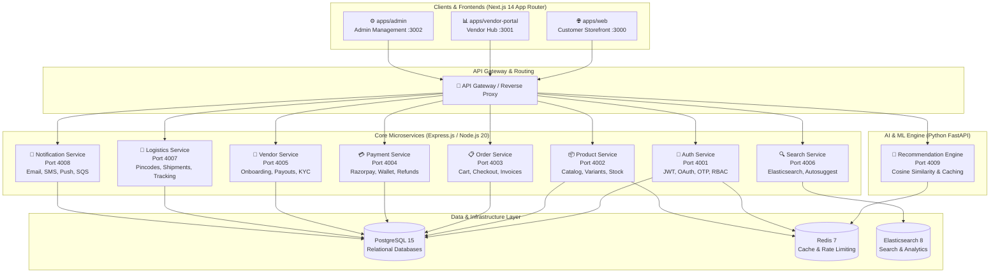

# 🛒 NexMart — Next-Generation E-Commerce Platform

<div align="center">


[](https://nextjs.org/)
[](https://www.typescriptlang.org/)
[](https://tailwindcss.com/)
[](https://expressjs.com/)
[](https://fastapi.tiangolo.com/)
[](https://turbo.build/)
[](https://www.docker.com/)

**NexMart** is a hyper-scalable, cloud-native e-commerce marketplace platform engineered for high-concurrency B2C/B2B retail, real-time logistics tracking, AI-powered recommendations, multi-vendor management, and lightning-fast storefront performance.

[Explore Demo](#-quick-start) • [Architecture](#-system-architecture) • [Microservices](#-backend-microservices) • [Design System](#-design-system)

</div>

---

## 🏗️ System Architecture



---

## ✨ Features & Highlights

### 🛍️ Customer Storefront (`apps/web`)
- **Pixel-Perfect UI**: Custom palette (`#5B4FE9` Indigo, `#F59E0B` Amber, `#10B981` Emerald), 8px grid, smooth micro-interactions via Framer Motion.
- **Dynamic Homepage**: Auto-rotating Embla carousel banner, category chips, live countdown Deal of the Day timer, brand showcase, and NexMart Plus subscription teaser.
- **Faceted Product Search & Catalog**: Multi-attribute filtering (category, brand, price slider, color swatch, star ratings), sort by relevance/price/rating, responsive 2 to 5 column grid.
- **Product Detail View**: High-resolution gallery with thumbnail selector and zoom, variant toggles, pincode delivery estimator, tabbed specs, bundled frequently bought together items, customer reviews breakdown with star rating form.
- **Persistent Shopping Cart & Checkout**: Zustand-powered cart with quantity controls, coupon validation (`NEXMART10`, `FIRST50`), 5-step checkout flow (Address -> Order Summary -> Payment Gateways -> Confirmation).
- **Comprehensive Account Portal**: Profile management, interactive order timeline (Placed -> Confirmed -> Packed -> Shipped -> Delivered), address book, and wishlist.
- **Zero-Spinner Skeleton States**: Clean shimmer loading skeletons across all pages for optimal perceived performance.

### 🏪 Vendor Portal (`apps/vendor-portal`)
- Dashboard with real-time GMV, daily order count, listed items, and customer ratings.
- Product inventory management and bulk upload tool.
- Order fulfillment workflow and automated payout tracking.

### ⚙️ Admin Control Panel (`apps/admin`)
- Platform-wide GMV metrics, user & vendor KYC verification.
- Content Management System (CMS) for homepage promotional banners.
- Moderation queue for product listings and audit logs.

### 🤖 AI Recommendation Service (`services/recommendations`)
- FastAPI Python microservice with cosine similarity collaborative filtering for personalized feeds, similar items, and frequently bought together pairings.

---

## 🎨 Design System & Brand Identity

| Token | Hex Value | Usage |
|---|---|---|
| **Primary** | `#5B4FE9` | Brand identity, primary CTAs, active highlights |
| **Accent** | `#F59E0B` | Badges, countdowns, rating stars, Deal of the Day |
| **Success** | `#10B981` | Free delivery chips, verified badges, savings notifications |
| **Error** | `#EF4444` | Stock alerts, discount badges, form errors |
| **Fonts** | *Plus Jakarta Sans* (Headings), *Inter* (Body), *JetBrains Mono* (Prices & Codes) |

---

## 🔌 Backend Microservices

| Service | Port | Description |
|---|---|---|
| **Auth** | `4001` | JWT authentication, refresh token rotation, bcrypt hashing, Google OAuth, OTP |
| **Products** | `4002` | Catalog management, multi-variant options, image galleries, stock locking |
| **Orders** | `4003` | Cart operations, checkout workflows, order status state machine, cancellation |
| **Payments** | `4004` | Razorpay checkout integration, signature verification, NexMart wallet |
| **Vendors** | `4005` | Vendor registration, KYC review, commission split, payout ledger |
| **Search** | `4006` | Full-text product search, autocomplete, faceted filtering using Elasticsearch |
| **Logistics** | `4007` | Indian pincode serviceability check, courier assignment, AWB tracking |
| **Notifications** | `4008` | Asynchronous event dispatch for SMS, transactional emails, push notifications |
| **Recommendations** | `4009` | Python FastAPI recommendation engine with Redis caching |

---

## 🚀 Quick Start

### Prerequisites
- Node.js 20+
- npm 10+
- Docker & Docker Compose

### 1. Clone & Install Dependencies
```bash
git clone https://github.com/JanSteve/NexMart-Ecommerce-Website.git
cd NexMart-Ecommerce-Website
npm install
```

### 2. Environment Configuration
```bash
cp .env.example .env
```

### 3. Start Database & Infrastructure
```bash
docker compose up -d
```

### 4. Run Development Server
```bash
# Start all workspaces via Turborepo
npm run dev

# Or run just the Storefront
npm run dev:web
```

Open [http://localhost:3000](http://localhost:3000) in your browser to explore NexMart Storefront!

---

## 📦 Project Structure

```
.
├── apps/
│   ├── web/               # Next.js 14 Customer Storefront (Port 3000)
│   ├── vendor-portal/     # Next.js 14 Vendor Management Portal (Port 3001)
│   └── admin/             # Next.js 14 Admin Control Panel (Port 3002)
├── services/
│   ├── auth/              # Port 4001
│   ├── products/          # Port 4002
│   ├── orders/            # Port 4003
│   ├── payments/          # Port 4004
│   ├── vendors/           # Port 4005
│   ├── search/            # Port 4006
│   ├── logistics/         # Port 4007
│   ├── notifications/     # Port 4008
│   └── recommendations/   # Port 4009 (FastAPI)
├── packages/
│   └── shared-types/      # Shared TypeScript types & Zod schemas
├── scripts/
│   ├── seed.ts            # Master seed runner
│   ├── seed-products.ts   # 200 rich seed products across 7 categories
│   └── seed-users.ts      # 100 test users, 5 vendors, 2 admins
├── infra/
│   └── terraform/         # AWS ECS, RDS, Redis, S3, CloudFront Terraform IAC
└── docker-compose.yml     # PostgreSQL 15, Redis 7, Elasticsearch 8.10
```

---

## 👨‍💻 Authors & Credits

- **R. Jan Steve Daniel** — Architecture & Full-Stack Development
- **InfinityForge**

*Built with Next.js 14, Tailwind CSS, Express.js, TypeScript, and Python.*
